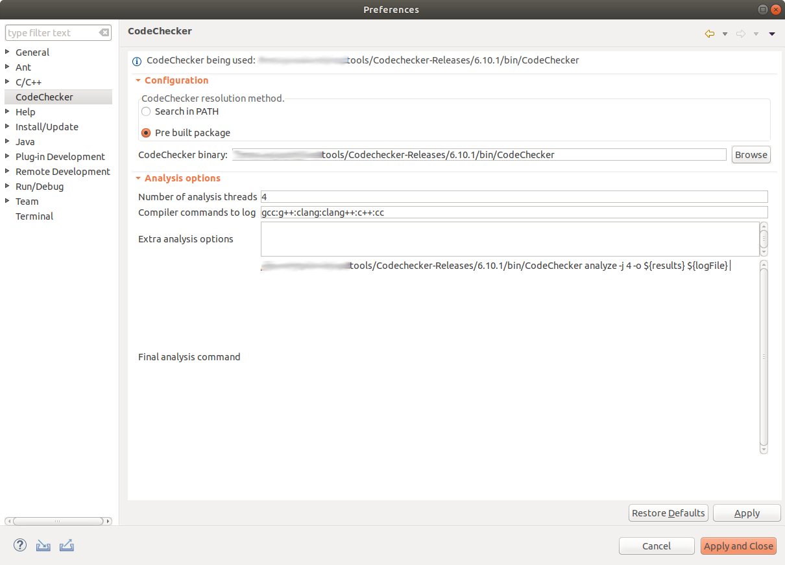

# CodeChecker Eclipse Plugin

This is a C/C++ code analysis plugin for Eclipse that shows bugs detected by the [Clang Static Analyzer](http://clang-analyzer.llvm.org/) and [Clang Tidy](http://clang.llvm.org/extra/clang-tidy/) analyzers, using [CodeChecker](https://github.com/Ericsson/codechecker) as a backend,

## Requirements

* Linux operating system
* Recent [CodeChecker](https://github.com/Ericsson/codechecker) (6.8.0 and up)
* Every eclipse version since [Oxygen 1](https://www.eclipse.org/downloads/packages/release/oxygen/1) (v4.7.0) is supported
* Eclipse CDT
* Java SE 1.8

## Build and install CodeChecker Eclipse Plugin

### Build

Run `mvn -f mavendeps/pom.xml p2:site && mvn clean verify` in the root of the project.

### Install

* Add the generated update site thats located under `path/to/cloned/project/releng/org.codechecker.eclipse.update/target/repository/` to `Help -> Install New Software...` in Eclipse
* Select the newly added repository if not already selected
* Mark CodeChecker Eclipse Plugin then hit next.
* If an alert box comes up with unsigned content. Just accept it.

## How to use
Make sure that before staring Eclipse:

* CodeChecker/bin directory is included in PATH (e.g.: `export PATH="/home/<username>/CodeChecker/bin/:$PATH"`)

__Currently the plugin is only usable with a CDT project.__

#### 1. Setup Perspective
In Eclipse, select Window, Perspectives, and activate the CodeChecker perspective.
Alternatively, you can manually add the two windows under the CodeChecker category into any perspective, using the Window - Views menu.  
__Make sure to check if CDT is installed properly if you do not see the CodeChecker perspective on the list!__

#### 2. Setup Nature
The plugin is activated on a per project basis, first you have to add the __CodeChecker Nature__ to a CDT project using the projects context menu in the project explorer with `Add CodeChecker Nature` command.

#### 3. Configure CodeChecker and checkers
After that, the settings can be customized in the project preferences window under the CodeChecker panel. For the plugin to work correctly, it is mandatory to add the correct path to the root of the CodeChecker package. You can download and compile CodeChecker from [here](https://github.com/Ericsson/codechecker).

After the plugin is successfully configured for a project, it'll listen to build events, and automatically rechecks the project with CodeChecker when needed.

#### 4. Set up eclipse C/C++ build environment

The code analysis runs only if your project can be built by Eclipse (as it intercepts gcc build commands).
Please check that your builder is set up correctly in properties/C/C++ Build settings.
If all goes well, you should be able to build your project from Eclipse using the Project/Build Project menu item.

#### 5. Analyze C/C++ project and view results
By default the plugin displays the problems related to the currently selected file on the current file reports view. Here the viewer can decide to check the individual reports selected from the reports tree, and view the related bugpath. Double clicking on a bugpath item will jump and set the cursor to that line in the editor.

*Please note that codechecker will only show analysis results for files that you built. This means that if you want to see all bugs for your project you will need to do a full (clean) build. After you update a source file, analysis results will be updated when you rebuild your project.*

## Contributing

For further information see [developer documentation](docs/developer.md).
